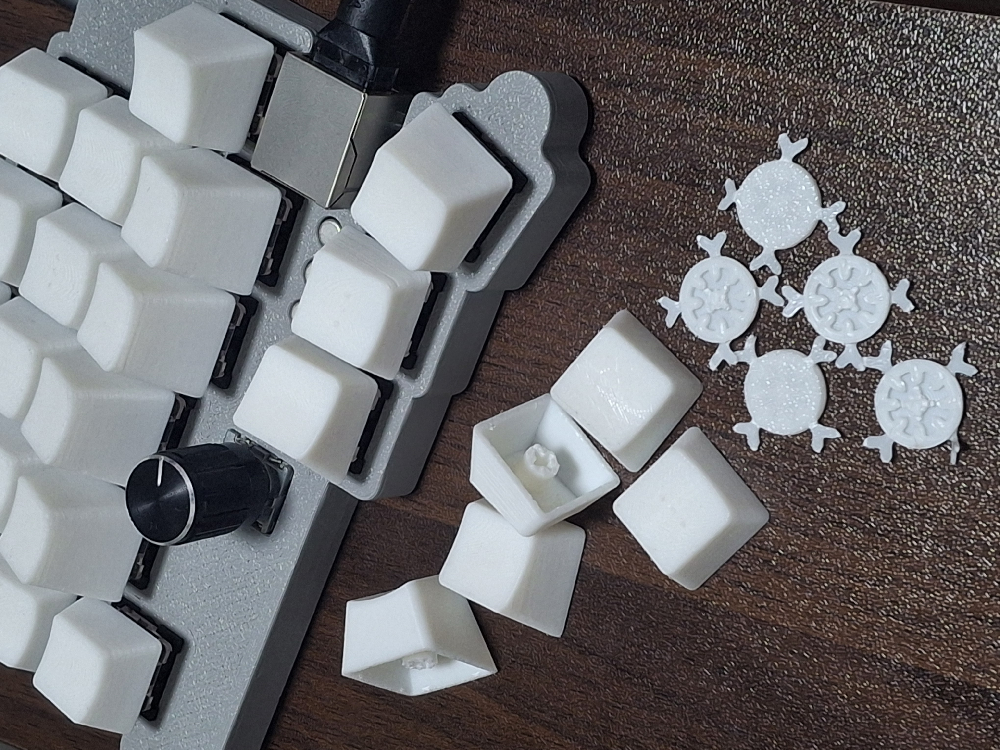

# printyl

**printyl** is MX keycaps which optimized for fdm printers, inspired by KLP Lame and keywell(dactyl). Works best with MX switches.

print things in the folder "withSupports" or "printingSet", and please tear off inner supports by proper tools like chisel, flathead screwdriver, or pliers.

* **75**: 7.5 degree profile key

* **75tact**: 75 with tactile points

* **7515left&7515right**: tilted 15 degree left&right from 75

* **225**: 22.5 degree profile key

In printingSet folder, there's the set of a columns and thumb clusters. print which you want.

- **3col** contains two 75 and one 225

- **3col+1tact** contains 75, 75tact, and 225

- **3thumb+1tact** contains 7515left, 7515right, and 75tact

- **4col** contains two 75 and two 225

- **4col+1tact** contains 75, 75tact, and two 225

- **3thumb+1tact** contains 7515left, 7515right, 75, and 75tact

Set layer height to 0.08mm, but still 0.12 layer height looks acceptable.

Licensed by CC BY-SA 4.0
