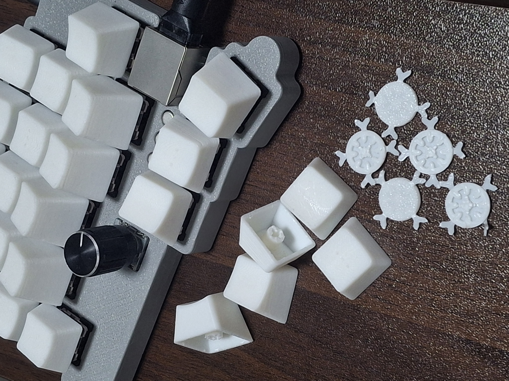

# printyl

**printyl** is MX keycaps which optimized for fdm printers, inspired by KLP Lame and keywell(dactyl). Works best with MX switches.

print things in the folder "withSupports" or "printingSet", and please tear off inner supports by proper tools like chisel, flathead screwdriver, or pliers.

* **75**: 7.5 degree profile key

* **75tact**: 75 with tactile points

* **75side15left&right**: tilted 15 degree left&right from 75

* **75side75left&right**: tilted 7.5 degree left&right from 75

* **75side225left&right**: tilted 22.5 degree left&right from 75

* **225**: 22.5 degree profile key

* **225side15left&right**: tilted 15 degree left&right from 25

* **225side75left&right**: tilted 7.5 degree left&right from 225

In printingSet folder, there's the set of columns and thumb clusters. print which you want.

- **3col** contains two 75 and one 225

- **3col+1tact** contains 75, 75tact, and 225

- **3thumb+1tact** contains 75side15left, 75side15right, and 75tact

- **4col** contains two 75 and two 225

- **4col+1tact** contains 75, 75tact, and two 225

- **3thumb+1tact** contains 75side15left, 75side15right, 75, and 75tact

- **4col15** contains 75side15left, 75side15right, 225side15left, and 225side15right

- **4thumbSide** contains 75side75left, 75side75right, 75side225left, and 75side225right  

- **2thumbSide** contains 75side75left and 75side75right

- **2thumbUp** contains 75side225left and 75side225right 

Set layer height to 0.08mm, but still 0.12 layer height looks acceptable.

Licensed by CC BY-SA 4.0
